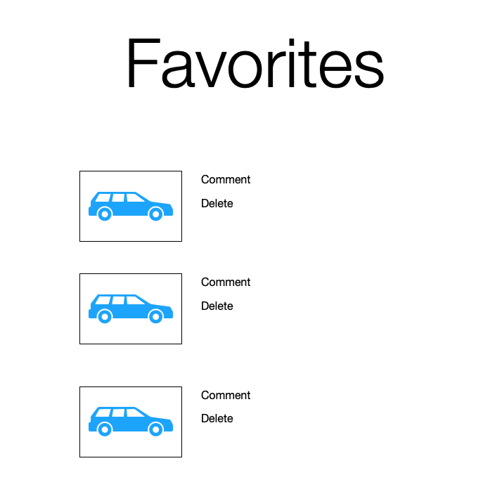
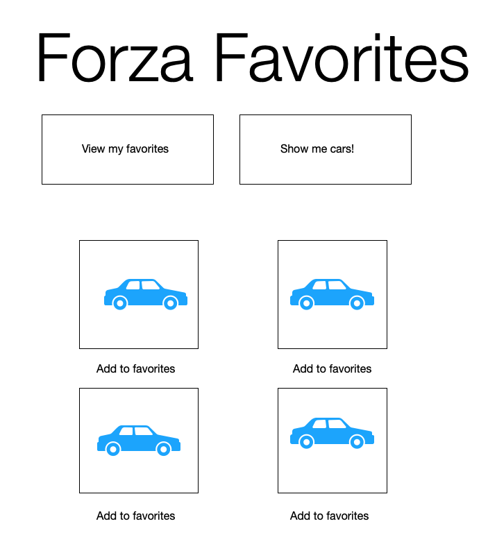
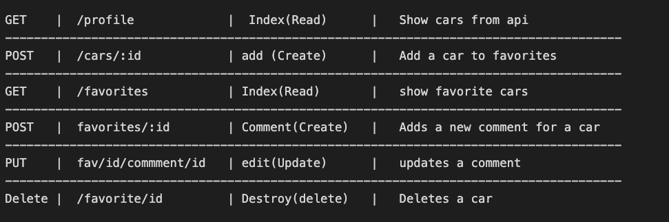
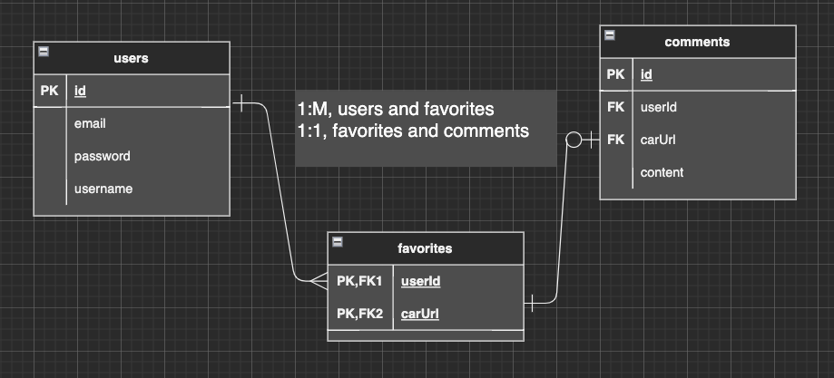

# Forza_Favorites

This app will allow users to search the forza api for pictures of cars and save their favorites to a list.  They will be able to write comments on their favorite cars.

# Installation instructions

+ Fork and clone this repository
+ you will need a .env file to store your API_KEY and your ENC_KEY
+ this app uses the forza api
+ you will need to use nodemon to consistently restart your app
+ npm i to install dependencies

# Wireframes

# RESTful routes

# Erd

# Mvp

+ user should be able to sign up and login
+ user should be able to view list of randomly generated cars
+ user should be able to add a car to their favorites list
+ user should be able to comment on their favorites
+ user should be able to delete car from favorites

# Stretch goals

+ style site
+ user can comment on cars that are not on their list
