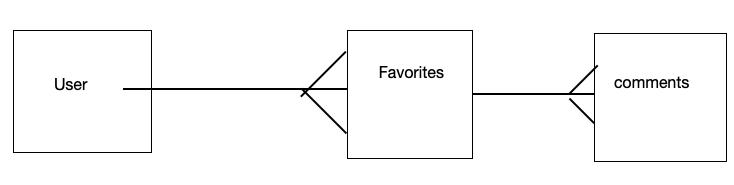

# Forza_Favorites

This app will allow users to search the forza api for awesome cars and save their favorites to a list.  They will be able to write comments on their favorite cars.

# Wireframes

# RESTful routes

GET 		/cars			Index(Read)			Show new cars

GET		/cars	/:id  		Show(Read)			List information about a specific car

Put		cars/:id		Comment(Update) 		adds a new comment for a car

Delete	/cars/id		Destroy(delete)			Deletes a car

# Erd

# Mvp

+ user should be able to sign up and login
+ user should be able to view list of randomly generated cars
+ user should be able to add a car to their favorites list
+ user should be able to comment on their favorites
+ user should be able to delete car from favorites

# Stretch goals

+ style site
+ user can comment on cars that are not on their list
